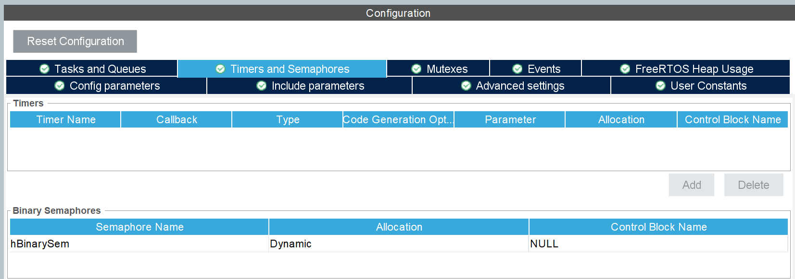
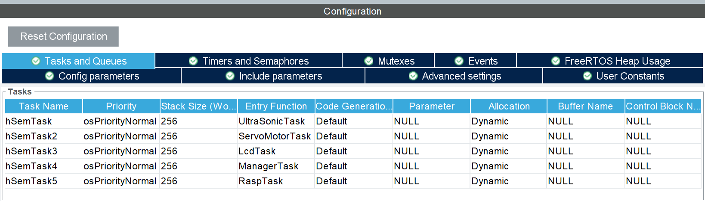
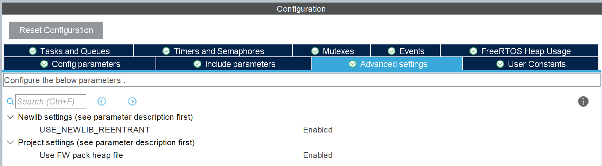

# STMCUBEIDE IOC SETTING

## RTOS

* Timebase Source for RTOS

RTOS를 사용하려면 Timebase Source를 systick이 아니라 다른 TIM를 사용해야한다.

* Interface
  
저희는 CMSIS_V1을 사용했습니다. 하지만 V2를 사용해도 큰 문제는 없습니다.   

* Binary semaphore

저희는 RTOS 방식 중에 MUTEX도 고려해보고 코딩도 해봤지만 Binary Semaphore로 결정했습니다.
그 이유는 서로 다른 Task내에서 변수 이동이 활발하기 때문에 다른 스레드가 접근하기 용이하다는 장점 때문입니다.

* Task Add

peripheral을 여러 개 사용하고 통신을 위해 Task를 5개 추가하였습니다. 그리고 스택 사이즈를 256까지 늘리고 priority를 모두 Normal로 동일시켰습니다.

* Enable

Enable을 시켜주면서 newlib 함수들이 각각의 스레드에 대한 별도의 상태를 유지하고, 이를 통해 여러 스레드가 동시에 C 라이브러리 함수를 호출할 때 문제가 발생하지 않도록 보장합니다.